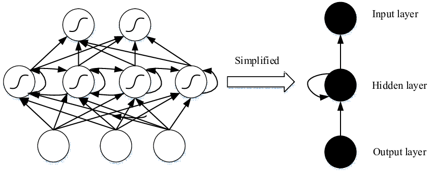
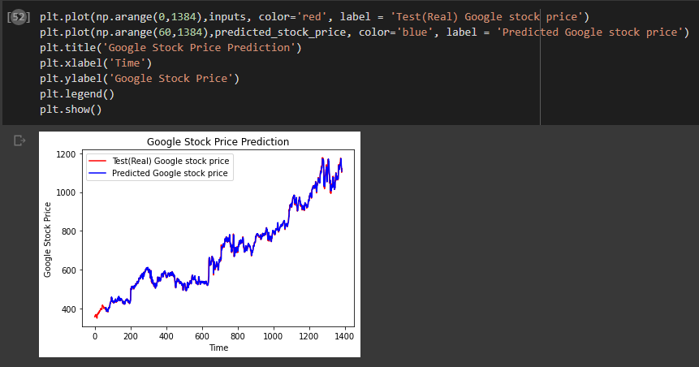
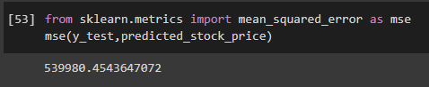

# Stock Price Prediction

## AIM

To develop a Recurrent Neural Network model for stock price prediction.

## Problem Statement and Dataset
RNNs suffer from the problem of vanishing gradients. The gradients carry information used in the RNN, and when the gradient becomes too small, the parameter updates become insignificant. This makes the learning of long data sequences difficult.

## Neural Network Model



## DESIGN STEPS

### STEP 1:
Develop a Recurrent Neural Network model for stock price prediction using the stock prediction dataset.
### STEP 2:
Load the stock dataset.
### STEP 3:
Fit the model and then predict.

## PROGRAM

```
Program developed by : Shrruthilaya G
Register number : 212221230097

import numpy as np
import matplotlib.pyplot as plt
import pandas as pd
from sklearn.preprocessing import MinMaxScaler
from keras import layers
from keras.models import Sequential

df_train = pd.read_csv('trainset.csv')
df_train.head(60)

train_set = df_train.iloc[:,1:2].values
train_set.shape

sc = MinMaxScaler(feature_range=(0,1))
training_set_scaled = sc.fit_transform(train_set)

X_train_array = []
y_train_array = []
for i in range(60, 1259):
  X_train_array.append(training_set_scaled[i-60:i,0])
  y_train_array.append(training_set_scaled[i,0])
X_train, y_train = np.array(X_train_array), np.array(y_train_array)

X_train

X_train1 = X_train.reshape((X_train.shape[0], X_train.shape[1],1))

X_train1

model = Sequential([layers.SimpleRNN(50,input_shape=(60,1)),
                    layers.Dense(1)
                    ])

model.compile(optimizer='Adam', loss='mse')

model.fit(X_train1,y_train,epochs=100,batch_size=32)  

df_test=pd.read_csv("testset.csv")
test_set = df_test.iloc[:,1:2].values

dataset_total = pd.concat((df_train['Open'],df_test['Open']),axis=0)

predicted_stock_price_scaled = model.predict(X_test)
predicted_stock_price = sc.inverse_transform(predicted_stock_price_scaled)

plt.plot(np.arange(0,1384),inputs, color='red', label = 'Test(Real) Google stock price')
plt.plot(np.arange(60,1384),predicted_stock_price, color='blue', label = 'Predicted Google stock price')
plt.title('Google Stock Price Prediction')
plt.xlabel('Time')
plt.ylabel('Google Stock Price')
plt.legend()
plt.show()

from sklearn.metrics import mean_squared_error as mse
mse(y_test,predicted_stock_price)
```

## OUTPUT

### True Stock Price, Predicted Stock Price vs time



### Mean Square Error



## RESULT
Thus a Recurrent Neural Network model for stock price prediction is created and executed successfully.
